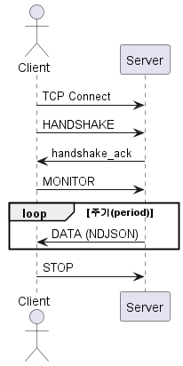

## 0.1 Open Stream이란?

해당 기능은 ${cont_model} Open API를 짧은 주기로 반복 호출하여,  
클라이언트가 그 결과를 스트리밍 형태로 지속적으로 수신할 수 있도록 제공되는 인터페이스입니다.

 

${cont_model} 제어기 내부의 TCP 기반의 경량 서버를 통해  
외부 클라이언트가 서버와 데이터를 연속적으로 송수신할 수 있도록  
제공되는 스트리밍 인터페이스입니다.

 

Open Stream은 다음과 같은 특징을 가집니다.

- 하나의 TCP 연결을 장시간 유지합니다
- 요청과 응답은 NDJSON(Newline Delimited JSON) 형식을 사용합니다
- 주기적인 데이터 송신(`MONITOR`)과 즉시성 제어 명령(`CONTROL`)을 동시에 지원합니다
- HTTP 요청/응답을 반복적으로 생성하지 않습니다

 

Open Stream은 짧은 주기로 제어 명령과 상태 수신을 하나의 연결에서 처리해야 하는  
클라이언트 환경을 위해 설계되었습니다.

 

## 0.2 전체 동작 개요

Open Stream의 기본 동작 흐름은 다음과 같습니다.

  

    
  

  

    <ol>
      <li>클라이언트가 서버에 TCP로 접속합니다</li> 
      <li>클라이언트가 HANDSHAKE 명령을 송신합니다</li> 
      <li>서버가 프로토콜 버전을 확인합니다</li> 
      <li>클라이언트가 MONITOR* 또는 CONTROL* 명령을 송신합니다</li> 
      <li>서버가 주기 데이터 또는 처리 결과를 송신합니다</li> 
      <li>필요 시 STOP 명령으로 동작을 종료합니다</li>
    </ol>
  

 



*MONITOR 명령이란? 클라이언트가 지정한 하나의 ${cont_model} Open API 서비스 함수를 짧은 주기로 반복 호출하여,
그 결과를 스트리밍 형태로 지속적으로 수신합니다.

*CONTROL 명령이란? 클라이언트가 ${cont_model} Open API를 통해 단발성 제어 요청을 전달하기 위한 명령입니다. 클라이언트는 필요에 따라 짧은 주기로 반복 송신할 수 있습니다.



Open Stream은 하나의 TCP 연결 내에서 MONITOR와 CONTROL 명령을 함께 사용할 수 있습니다.



단, 하나의 연결에서는 하나의 MONITOR 세션, 하나의 CONTROL 세션만 활성화할 수 있습니다.

