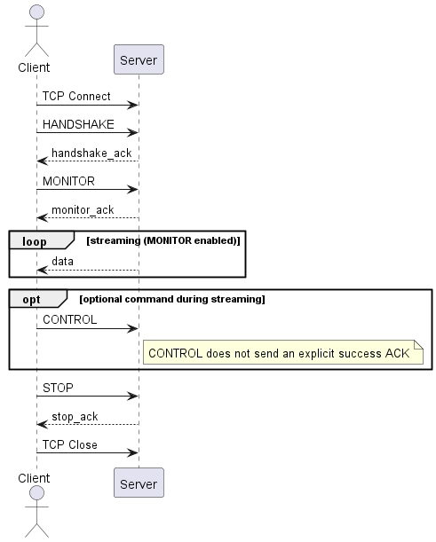

## 1.1 What is Open Stream?

Open Stream is an interface that allows clients to continuously receive results in a streaming manner  
by repeatedly invoking **${cont_model} Open APIs** at short intervals.

 

It provides a streaming interface through a **TCP-based lightweight server** embedded inside the ${cont_model} controller,  
enabling external clients to continuously send and receive data over a persistent connection.

 

Open Stream has the following characteristics:

- Maintains a **single long-lived TCP connection**
- Uses **NDJSON (Newline Delimited JSON)** for requests and responses
- Supports both **periodic data streaming (`MONITOR`)** and **immediate control commands (`CONTROL`)**
- Eliminates repeated creation of HTTP request/response cycles

 

Open Stream is designed for client environments that require handling  
**high-frequency control commands and status monitoring over a single connection**.

  

<b>Overall Operation Overview</b>

The basic operational flow of Open Stream is as follows.

<!-- Left: Image -->

  

<!-- Right: Ordered List -->

  <ol style="line-height:1.5;">

  <li>The client establishes a TCP connection to the server, creating a session.</li> 

  <li>Immediately after connection, the client sends a <code>HANDSHAKE</code> command 
      to verify protocol version compatibility with the server.</li> 

  <li>The server processes the <code>HANDSHAKE</code> request and, if the protocol version is compatible, sends a <code>handshake_ack</code> event.</li> 

  <li>After a successful <code>HANDSHAKE</code>, the client may request periodic data streaming using the <code>MONITOR</code> command, or execute one-shot requests using the <code>CONTROL</code> command.
      <small>(CONTROL commands can be sent even while MONITOR is active.)</small>
  </li> 

  <li>When <code>MONITOR</code> is active, the server sends <code>data</code> events at the configured interval, independent of additional client requests.</li> 
    
  <li>Successful <code>CONTROL</code> commands do not generate ACK responses. 
      Only failures may result in <code>error</code> or <code>control_err</code> events.</li> 

  <li>When operations are complete, the client sends a <code>STOP</code> command
      to indicate termination of active operations or session intent,
      and closes the TCP connection after receiving <code>stop_ack</code>.
  </li>

  </ol>

 



**What is the MONITOR command?**  
The MONITOR command repeatedly invokes a single ${cont_model} Open API service at a client-defined interval  
and continuously streams the results to the client.

**What is the CONTROL command?**  
The CONTROL command is used to send one-shot control requests to the ${cont_model} Open API.  
Clients may send CONTROL commands repeatedly at short intervals as needed.



Open Stream allows MONITOR and CONTROL commands to be used together within a single TCP connection.



However, within a single connection, **only one MONITOR session and one CONTROL session** can be active at the same time.


