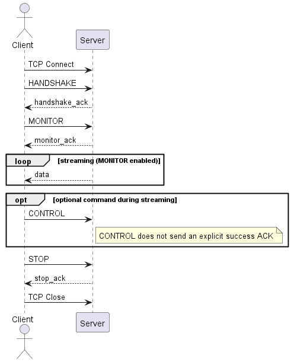

## 1.1 什么是开放流？

开放流是一个接口，允许客户端以流式方式持续接收结果  
通过在短时间间隔内反复调用 **${cont_model} Open APIs**。

 

它通过嵌入在 ${cont_model} 控制器内的 **基于TCP的轻量级服务器** 提供流式接口，  
使外部客户端能够在持久连接上持续发送和接收数据。

 

开放流具有以下特点：

- 维护 **单一的长期TCP连接**
- 对请求和响应使用 **NDJSON（新行分隔的JSON）**
- 支持 **周期性数据流（`MONITOR`）** 和 **即时控制命令（`CONTROL`）**
- 消除了重复创建HTTP请求/响应循环

 

开放流旨在为需要处理  
**通过单一连接进行高频控制命令和状态监控** 的客户端环境设计。

  

<b>整体操作概述</b>

开放流的基本操作流程如下。

<!-- Left: Image -->

  

<!-- Right: Ordered List -->

  <ol style="line-height:1.5;">

  <li>客户端与服务器建立TCP连接，创建会话。</li> 

  <li>连接后，客户端立即发送 <code>HANDSHAKE</code> 命令 
      以验证与服务器的协议版本兼容性。</li> 
<li>服务器处理<code>HANDSHAKE</code>请求，并且如果协议版本兼容，则发送<code>handshake_ack</code>事件。</li> 

<li>在成功的<code>HANDSHAKE</code>后，客户端可以使用<code>MONITOR</code>命令请求定期数据流，或使用<code>CONTROL</code>命令执行一次性请求。
    <small>（即使在MONITOR活动期间，也可以发送CONTROL命令。）</small>
</li> 

<li>当<code>MONITOR</code>处于活动状态时，服务器在配置的间隔内发送<code>data</code>事件，而不考虑额外的客户端请求。</li> 

<li>成功的<code>CONTROL</code>命令不会生成ACK响应。 
    只有失败可能导致<code>error</code>或<code>control_err</code>事件。</li> 

<li>当操作完成时，客户端发送<code>STOP</code>命令
    以指示终止活动操作或会话意图，
    并在收到<code>stop_ack</code>后关闭TCP连接。
</li>

</ol>

 



**MONITOR命令是什么？**  
MONITOR命令在客户端定义的间隔内重复调用单个${cont_model} Open API服务  
并持续将结果流传输到客户端。

**CONTROL命令是什么？**  
CONTROL命令用于向${cont_model} Open API发送一次性控制请求。  
客户端可以根据需要以短间隔重复发送CONTROL命令。



Open Stream允许在单个TCP连接内一起使用MONITOR和CONTROL命令。



然而，在单个连接内，**只能同时激活一个MONITOR会话和一个CONTROL会话**。

