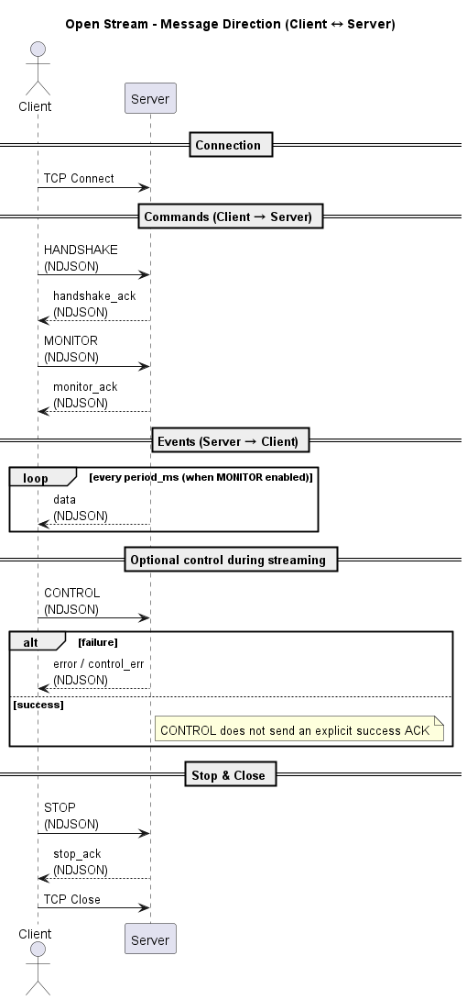

# Session & Streaming



이 문서는 Open Stream을 실제로 구현하고 운영하기 위해 반드시 이해해야 하는  
<b>세션 라이프사이클(Session Lifecycle)</b> 과 <b>스트리밍 동작 방식(Streaming Behavior)</b> 을 설명합니다.



 

<h4 style="font-size:16px; font-weight:bold;">1. 세션 라이프사이클</h4>

Open Stream은 <b>TCP 연결 1개를 하나의 세션(Session)</b> 으로 간주합니다.  
일반적인 세션 흐름은 다음과 같습니다.

1. 클라이언트가 서버와 TCP 연결을 생성합니다.
2. 클라이언트는 연결 직후 `HANDSHAKE` 명령을 전송합니다.
3. 클라이언트는 `MONITOR` 및/또는 `CONTROL` 명령을 요청합니다.  
    ※ `MONITOR`가 활성화된 경우, 서버는 주기적으로 `data` 이벤트를 스트리밍합니다.
4. 작업이 완료되면 클라이언트는 `STOP` 명령을 전송합니다.
5. 이후 TCP 연결을 종료합니다.

 

<h4 style="font-size:16px; font-weight:bold;">2. 사용 규칙</h4>

다음 규칙은 Open Stream을 올바르게 사용하기 위해 지켜야하는 규칙입니다.

- `HANDSHAKE`는 <b>세션 초기에 수행</b>해야 합니다.
- `HANDSHAKE` 이전에 `MONITOR` 또는 `CONTROL`을 호출하면 서버가 거부할 수 있습니다.
- 하나의 세션에서 동시에 하나의 `MONITOR`만 활성화하는 것을 권장합니다.
- `STOP(target=session)`은 “정상 종료 의도”를 명시하는 용도로 사용하며  
   이후 TCP Close를 수행하는 구조를 권장합니다.

 
<h4 style="font-size:16px; font-weight:bold;">3. 메세지 방향</h4>

Open Stream에서 사용되는 메시지는 <b>방향과 역할</b>에 따라 다음과 같이 구분됩니다.

  <!-- Left: Diagram -->
  

    
  

  <!-- Right: Two tables -->

  

    
Client → Server (Commands)

    <table style="width:fit-content; min-width:fit-content; border-collapse:collapse;">
      <thead>
        <tr>
          <th>Command</th>
          <th>Description</th>
        </tr>
      </thead>
      <tbody>
        <tr><td><code>HANDSHAKE</code></td><td>프로토콜 버전 협상</td></tr>
        <tr><td><code>MONITOR</code></td><td>주기적 데이터 스트리밍 설정</td></tr>
        <tr><td><code>CONTROL</code></td><td>명령성 REST 요청 실행</td></tr>
        <tr><td><code>STOP</code></td><td>활성 동작 또는 세션 종료</td></tr>
      </tbody>
    </table>
  

  

    
Client ⇠ Server (Events)

    <table style="width:fit-content; min-width:fit-content; border-collapse:collapse;">
      <thead>
        <tr>
          <th>Event</th>
          <th>Description</th>
          <th>Notes</th>
        </tr>
      </thead>
      <tbody>
        <tr>
          <td><code>*_ack</code></td>
          <td>명령이 수락되었음을 알리는 ACK</td>
          <td>예: <code>handshake_ack</code>, <code>monitor_ack</code>, <code>stop_ack</code></td>
        </tr>
        <tr>
          <td><code>data</code></td>
          <td>MONITOR 활성 시 주기적 데이터 이벤트</td>
          <td>Hi6 Open API 서비스 함수를 수행한 결과</td>
        </tr>
        <tr>
          <td><code>error</code></td>
          <td>오류 발생 시 전달되는 에러 메시지</td>
          <td>상세 코드는 Error Codes 섹션 참고</td>
        </tr>
      </tbody>
    </table>
  

  

  Server → Client 이벤트는 클라이언트 요청과 <b>1:1로 대응되지 않을 수 있습니다.</b>  
  특히 <code>data</code> 이벤트는 클라이언트 요청과 무관하게 언제든지 전송될 수 있습니다.  
  클라이언트는 항상 수신 루프를 유지해야 합니다.

  
  

 
<h4 style="font-size:16px; font-weight:bold;">4. MONITOR 스트리밍 동작 방식</h4>

`MONITOR`는 클라이언트가 전달한 레시피를 기준으로  
서버가 지정된 주기(`period_ms`)마다 Hi6 Open API 서비스 함수를 실행하고,  
그 결과를 `data` 이벤트로 스트리밍하는 서버 주도형 메커니즘입니다.

클라이언트는 다음 사항을 전제로 구현해야 합니다.

- 항상 수신 루프를 유지합니다.
- 요청–응답의 동기적 대응을 가정하지 않습니다.
- `data`, `*_ack`, `error` 이벤트는
  순서 보장이 없음을 전제로 처리해야 합니다.

 
<h4 style="font-size:16px; font-weight:bold;">5. CONTROL 명령 수행</h4>

`CONTROL`은 정책/구현에 따라 <b>성공 시 별도 응답 라인이 없습니다.</b>

권장 전략:

- 실패 신호는 `error` 또는 `control_err` 이벤트로 감지한다.
- 성공 여부는 다음 방식으로 검증한다.
  - MONITOR 결과 변화 확인
  - 별도 상태 조회 MONITOR endpoint 사용

 
<h4 style="font-size:16px; font-weight:bold;">6. Timeout / Watchdog</h4>

서버는 세션이 장시간 유휴 상태일 경우 연결을 종료할 수 있습니다.

클라이언트 권장 사항:

- 연결 직후 즉시 `HANDSHAKE` 수행
- 사용 종료 시 `STOP(target=session)` 후 정상 종료
- 스트리밍 중 수신 루프 중단 방지
- EOF 또는 소켓 오류 발생 시 재연결 및 재HANDSHAKE 로직 준비

현재 서버 구현 기준으로는 다음과 같은 정책이 적용됩니다.

- <b>비무장 상태(Idle / No active MONITOR)</b>  
  &rightarrow; 약 <b>180초</b> 동안 유의미한 활동이 없을 경우 세션 종료

- <b>무장 상태(Active MONITOR streaming)</b>  
  &rightarrow; 스트리밍이 중단된 상태가 <b>약 5초</b> 이상 지속될 경우 세션 종료

※ 위 시간 값은 서버 정책 또는 운영 환경에 따라 변경될 수 있습니다.

 
<h4 style="font-size:16px; font-weight:bold;">7. 권장 아키텍쳐 </h4>

실전 구현에서는 다음 구조를 권장합니다.

- 송신(Command)과 수신(Event)을 분리
  - 송신: 명령 생성 + sendall
  - 수신: NDJSON 라인 파서 + 디스패처

- 수신 루프의 단일 책임
  - `\n` 기준 라인 분리
  - JSON 파싱
  - `type` / `error` 기반 이벤트 라우팅