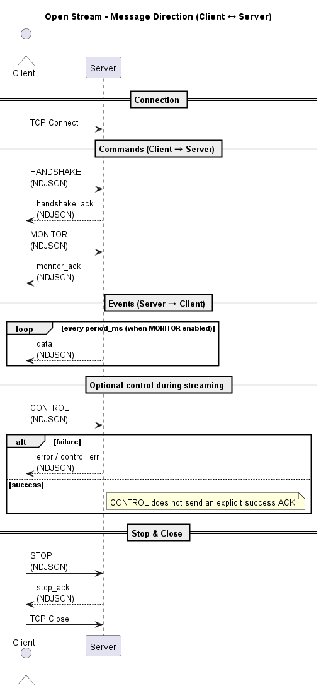

## 2.2 会话和流规则



本文件解释了 <b>会话生命周期</b> 和 <b>流行为</b>  
必须理解以正确实现和操作 Open Stream。



 

<h4 style="font-size:16px; font-weight:bold;">1. 会话生命周期</h4>

Open Stream 将 <b>一个 TCP 连接视为一个会话</b>。  
典型的会话流程如下：

1. 客户端通过 TCP 连接到服务器以创建会话。
2. 在连接后，客户端立即发送 `HANDSHAKE` 命令以验证与服务器的协议版本兼容性。
3. 处理完 `HANDSHAKE` 请求后，如果协议版本匹配，服务器将发送 `handshake_ack` 事件。
4. 在 `HANDSHAKE` 之后，客户端可以通过 `MONITOR` 请求周期性数据流，或通过 `CONTROL` 执行一次性请求。（在 `MONITOR` 活动时，也可以发送 `CONTROL`。）
5. 当 `MONITOR` 活动时，服务器会定期发送 `data` 事件，而不管额外的客户端请求。
6. `CONTROL` 命令在成功时不会单独发送 ACK；仅在失败时可能会发送 `error` 或 `control_err` 事件。
7. 工作完成后，客户端发送 `STOP` 以表示终止活动操作或会话的意图，然后在收到服务器的 `stop_ack` 后关闭 TCP 连接。



Open Stream 是一种事件驱动的流协议，不保证请求-响应的顺序。  
由于 `data`、`*_ack` 和 `error` 事件之间的到达顺序不 guaranteed，因此客户端必须在不依赖消息顺序的情况下处理事件。



 

<h4 style="font-size:16px; font-weight:bold;">2. 使用规则</h4>

以下规则必须遵循以正确使用 Open Stream。

- `HANDSHAKE` 必须在 <b>会话开始时</b> 执行。
- 如果在 `HANDSHAKE` 之前调用 `MONITOR` 或 `CONTROL`，服务器可能会拒绝请求。
- `STOP(target=session)` 用于明确表示"优雅终止意图"，并建议在之后关闭 TCP 连接。

 
<h4 style="font-size:16px; font-weight:bold;">3. 消息方向</h4>

消息在开放流中根据 <b>方向和角色</b> 被分类为以下几种。

  <!-- Left: Diagram -->
  

    
  

  <!-- Right: Two tables -->

  

    
客户端 → 服务器 (命令)

    <table style="width:fit-content; min-width:fit-content; border-collapse:collapse;">
      <thead>
        <tr>
          <th>命令</th>
          <th>描述</th>
        </tr>
      </thead>
      <tbody>
        <tr><td><code>HANDSHAKE</code></td><td>协议版本协商</td></tr>
        <tr><td><code>MONITOR</code></td><td>配置周期性数据流</td></tr>
        <tr><td><code>CONTROL</code></td><td>执行命令类型的REST请求</td></tr>
        <tr><td><code>STOP</code></td><td>终止活动操作或会话</td></tr>
      </tbody>
    </table>
  

  

    
客户端 ⇠ 服务器 (事件)

    <table style="width:fit-content; min-width:fit-content; border-collapse:collapse;">
      <thead>
        <tr>
          <th>事件</th>
          <th>描述</th>
          <th>备注</th>
        </tr>
      </thead>
      <tbody>
        <tr>
          <td><code>*_ack</code></td>
          <td>确认已接受命令的ACK</td>
          <td>例如 <code>handshake_ack</code>, <code>monitor_ack</code>, <code>stop_ack</code></td>
</tr>
<tr>
  <td><code>data</code></td>
  <td>当监控激活时的周期性数据事件</td>
  <td>执行${cont_model} Open API服务功能的结果</td>
</tr>
<tr>
  <td><code>error</code></td>
  <td>发生故障时发送的错误消息</td>
  <td>有关详细信息，请参阅错误代码部分</td>
</tr>
</tbody>
</table>



服务器 → 客户端事件可能<b>无法与客户端</b>请求一一对应。  
虽然`*_ack`和`error`遵循请求响应模式，  
但由监控生成的`data`事件是独立流式传输的。  
客户端必须始终保持接收循环运行。



| 请求-响应 | 流媒体 |
|---|---|
| 客户端 → `HANDSHAKE/MONITOR/CONTROL/STOP` → 服务器 客户端 ← `*_ack`, `error` ← 服务器 | （在`monitor_ack`之后） 服务器 → `data` → 客户端 服务器 → `data` → 客户端 ... |

 
<h4 style="font-size:16px; font-weight:bold;">4. MONITOR 流媒体行为</h4>

`MONITOR` 是一个服务器驱动的机制，基于客户端提供的配方，  
服务器以指定的时间间隔（`period_ms`）执行${cont_model} Open API服务功能  
并将结果作为`data`事件流式传输。

客户端必须在以下假设下实现。

- 始终保持接收循环运行。
- 不要假定同步请求-响应配对。

 
<h4 style="font-size:16px; font-weight:bold;">5. 控制命令执行</h4>
根据政策/实施，<b>CONTROL在成功时不提供单独的响应行。</b>

推荐策略：

- 通过`error`或`control_err`事件检测故障。
- 使用以下方法验证成功：
  - 确认MONITOR结果的变化
  - 使用专用状态查询MONITOR端点

 
<h4 style="font-size:16px; font-weight:bold;">6. 超时 / 看门狗</h4>

如果会话长时间保持空闲，服务器可能会终止连接。

客户端建议：

- 在连接后立即执行`HANDSHAKE`
- 使用`STOP(target=session)`进行优雅关机
- 在流媒体期间防止接收循环停止
- 在EOF或套接字错误时准备重新连接和重新执行HANDSHAKE逻辑

在当前服务器实施中，适用以下政策。

- <b>解除武装状态（空闲/无活动MONITOR）</b>  
  &rightarrow; 在大约<b>180秒</b>没有有意义的活动后，会话被终止

- <b>武装状态（活动MONITOR流媒体）</b>  
  &rightarrow; 如果流媒体中断超过大约<b>5秒</b>，则会话被终止

* 上述时间值可能会根据服务器政策或操作环境而变化。

 
<h4 style="font-size:16px; font-weight:bold;">7. 推荐架构 </h4>

对于实际实施，推荐以下结构。

- 分开发送（命令）和接收（事件）  
  &rightarrow; 发送：构建命令 + `sendall`  
  &rightarrow; 接收：NDJSON行解析器 + 分发器

- 单一责任接收循环  
  &rightarrow; 按`\n`拆分行  
  &rightarrow; JSON解析  
  &rightarrow; 基于`类型 (type)` / `error`的事件路由